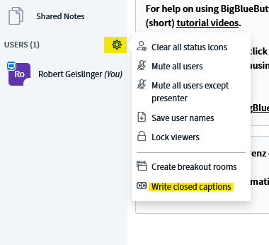
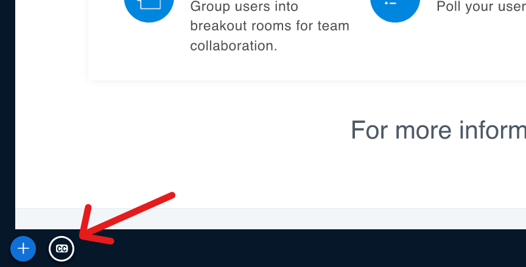
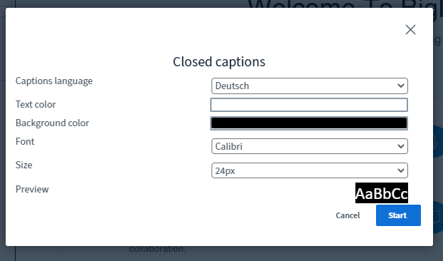

# bbb-live-subtitles
This project is a plugin for automatic subtitling in BigBlueButton (BBB), an open source web conferencing system. bbb-live-subtitles will run real time automatic speech recognition (ASR) and will generate subtitle captions on-the-fly. No cloud services are used for ASR, instead we use our own speech recognition models that can be run locally. This ensures that no privacy issues arise. There are pre-trained German and English models available and ready to use (English needs PyKaldi > 0.2.0 and Python 3.8). 

# Demo video
See our plugin in action in this [presentation video](https://ltdata1.informatik.uni-hamburg.de/bbb-live-subtitles/LiveSubtitlingBigBlueButton_English.mp4).

# Subtitling of BBB Participants
Currently, each BBB participant is subtitled individually. We use Kaldi/pyKaldi for automatic speech recognition (ASR). Any nnet3 compatible Kaldi model can be used. We offer free and ready to use models for [German ASR](https://github.com/uhh-lt/kaldi-tuda-de/) and an English model is available as well.
Also the subtitles are written into the Shared Notes and can be exported as PDF or a Word Document.

# Installation and prerequisites:
Tested with BigBlueButton 2.2.x, Ubuntu 20.04, Python 3.8 and [kaldi-model-server](https://github.com/uhh-lt/kaldi-model-server)

## Install and configure BBB-live-subtitles
```Shell
# Make sure you have Python 3.8 installed, its dev package and other dependencies: (Python 3.7 could work also. There is a PyKaldi wheel for 3.7 also)
sudo apt-get install python3.8 python3.8-dev portaudio19-dev

# Now clone the bbb-live-subtitles package somewhere:
mkdir ~/projects
cd ~/projects
git clone https://github.com/uhh-lt/bbb-live-subtitles
cd bbb-live-subtitles/

# create the virtual environment and install the dependencies
virtualenv -p /usr/bin/python3.8 bbbsub_env
source bbbsub_env/bin/activate
pip install redis pymongo jaspion pyyaml pyaudio samplerate scipy pyetherpadlite websockets

# Clone Kaldi-Model-Server
git clone https://github.com/uhh-lt/kaldi-model-server.git

# Install PyKaldi
# Download the PyKaldi wheel and install it

# PyKaldi 0.2.0:
wget http://ltdata1.informatik.uni-hamburg.de/pykaldi_tmp/pykaldi-0.2.1-cp38-cp38-linux_x86_64.whl
pip install pykaldi-0.2.1-cp38-cp38-linux_x86_64.whl

# Install Kaldi and Intel MKL (see note below if you have a different CPU than Intel)
./install_mkl.sh
./install_kaldi_intel.sh ~/projects/bbb-live-subtitles/bbbsub_env/bin/python3.8

# OR if you have a non-Intel CPU:
./install_kaldi.sh ~/projects/bbb-live-subtitles/bbbsub_env/bin/python3.8

# Download the english and german Model
./download_example_models.sh

```


When working with different machines (see Section "usage") the configuration of the redis server must be changed to allow remote access, as outlined below.

## Configure Redis to Accept Remote Connections
If you like to host the speech recognition on another server in your local network, you need to allow connections to redis in your local network.
When all scripts run on the same machine you can skip this step

Open the redis configuration file in an editor
```Shell
sudo nano /etc/redis/redis.conf
```
Change the line `bind 127.0.0.1` and add the local IP Adress of the server(eg. 192.168.0.1): `bind 127.0.0.1 192.168.0.1`.
Save the file and restart the redis server
```Shell
sudo /etc/init.d/redis-server restart
```
This would bind redis to the local IP Adress 192.168.0.1 as well as 127.0.0.1. You can now test the access from another machine within your network with `redis-cli` for example:
```Shell
redis-cli -h 192.168.0.1 -p 6379
```
Note that you shouldn't let Redis listen on a public IP, as you would otherwise expose raw speech data packages and other data to the public. If in doubt consult your admin about network and firewall settings and make sure that Redis can only be accessed from trusted hosts.

When using iptables as your firewall you can add a rule like this:
```Shell
iptables -A INPUT -p tcp --destination-port 6379 -m iprange --src-range 192.168.0.1-192.168.0.254 -j ACCEPT
```
This example opens the Port 6379 for TCP connections to a range of IP adresses between 192.168.0.1 and 192.168.0.254.

## Install libwebsockets and mod_audio_fork
To fork the audio we use the [mod_audio_fork](https://github.com/drachtio/drachtio-freeswitch-modules/tree/master/modules/mod_audio_fork) Plugin. This plugin needs libwebsockets to be installed.
We compiled already a compatible version so you only need to run the script with `sudo` to download and install it:
```Shell
sudo ./install_audio_fork.sh
```
Open the modules file with your favorite editor:
```Shell
sudo nano /opt/freeswitch/etc/freeswitch/autoload_configs/modules.conf.xml
```
Add the following at the end of the file but above `</modules>`:
```
    <load module="mod_audio_fork"/>
```
Save the changes and restart freeswitch:
```
sudo service freeswitch restart
```

# Add your Server and Keys to the script
To use the script you need to add your Server and API Keys.
## esl_to_redis
Add in line 9 your BBB hostname (or localhost).
Add in line 14 your Freeswitch password.
The password is stored in the file `/opt/freeswitch/etc/freeswitch/autoload_configs/event_socket.conf.xml`
## ws_receiver
Add in line 62 your BBB hostname (or localhost).
## mongodbconnector
To run the mongodbconnector you need to get the Etherpad API Key.
The Key is stored in `/usr/share/etherpad-lite/APIKEY.txt`


# Usage
To use this project you can run every script on remote machines or if your machine is fast enough all services on the same machine.
All the scripts need to run before the participants join the conference. ASR processing is only loaded once it is needed, otherwise the script stand by and wait for participants to join conferences. After the participant leaves the conference or leaves the audio of the conference the ASR stops. When the participant joins back the audio with microphone the ASR starts.

To run multiple Shells it is recommended to use tmux.

At first you need to start `esl_to_redis.py`. This module creates a connection to the FreeSWITCH Software through [ESL](https://freeswitch.org/confluence/display/FREESWITCH/Event+Socket+Library). It checks for new partitipants with audio and sends a message into the redis information channel.

The next to start is `ws_receiver.py`. This module starts a webSocket server and waits for incoming data. If a stream starts it copys the audiostream to a new REDIS-Channel.

The `kaldi_starter.py` module is in this configuration on another machine (could also run on the same machine) and starts for each media bug a seperate pykaldi instance with the Kaldi-model-server. The kaldi-model-server sends the transcrived speech back into a separate redis channel.
```Shell
python3 kaldi_starter.py -s server -c asr_channel
```

With the `mongodbconnector.py` module the ASR Data is written into the mongodb database and into the Notes. To see subtitles, the presenter needs to start the subtitle functionanilty in BBB and then the participants can activate the subtitles by clicking on the CC button.
Start `mongodbconnector.py` with your parameters:
```Shell
python3 mongodbconnector.py -s BBB_SERVER -c asr_channel -e ETHERPAD_API_KEY
```
To run all scripts except Kaldi you can also adapt and use the script `run.sh`. It runs `es_to_redis`, `ws_receiver` and `mongodbconnector` in one tmux session.


# Activate Subtitles in the conference
As a moderator:

Open the menu and click on "write closed captions"



Select in the dropdown menu german(Deutsch) and click Start


As a participant:
Click on the CC Button on the bottom of the conference



Select as the Caption Language german (Deutsch) an click Start



Now you see the captions at the bottom of the conference


# Known problems
There is an issue with Mozilla Firefox and recordings in freeswitch with opus. To use this project with Firefox you need to deactivate the opus codec.

Open the modules file with your favorite editor:
```Shell
sudo nano /opt/freeswitch/etc/freeswitch/autoload_configs/modules.conf.xml
```
The `mod_opus` must be commented out:
```XML
<-- <load module="mod_opus"/>-->
```
save and restart freeswitch:
```Shell
sudo service freeswitch restart
```

# Problems / Questions / Suggestions?
Feel free to write an issue, pull-request or a mail :)

## Citation

If you use the plugin, please cite our [paper](./Bigbluebutton_paper.pdf?raw=true):

```
@inproceedings{geislinger21_interspeech,
  author={Robert Geislinger and Benjamin Milde and Timo Baumann and Chris Biemann},
  title={{Live Subtitling for BigBlueButton with Open-Source Software}},
  year=2021,
  booktitle={Proc. Interspeech 2021},
  pages={3319--3320},
  address={Brno, Czech Republic}
}
```
